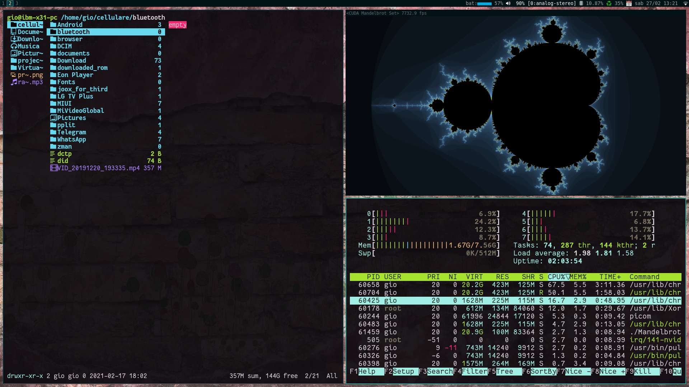
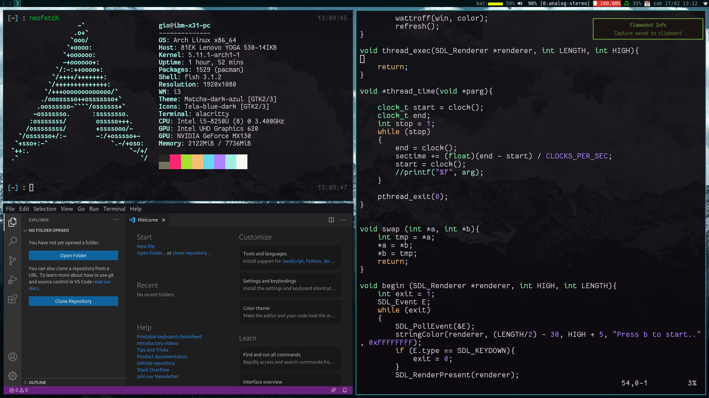

# DANCE

DANCE is collection of scripts that automatically installs a minimal riced version of i3-gaps (a window manager) with some other essential software. During the installation process you can choose in detail what to deploy. Currently the supported linux ditros are: Arch.
## Images


## Installation
If git is not installed install it with `sudo pacman -S git` then:
```
git clone https://github.com/durryx/dance
cd dance
sudo sh install.sh
```
If, before executing the script, you want to add or remove some packages to install just edit `config.yml`, it's quite easy to read. If you add some dotfiles you need to specify them in the files section of config.yml, first put the file or directory's name and after it's destination. All previous dotfiles will be overwritten.
-D.
